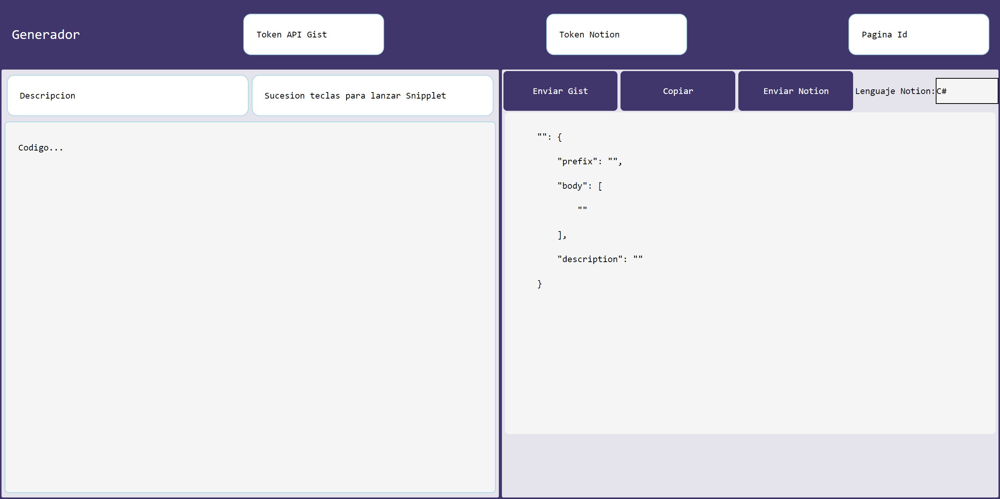
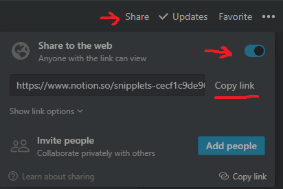
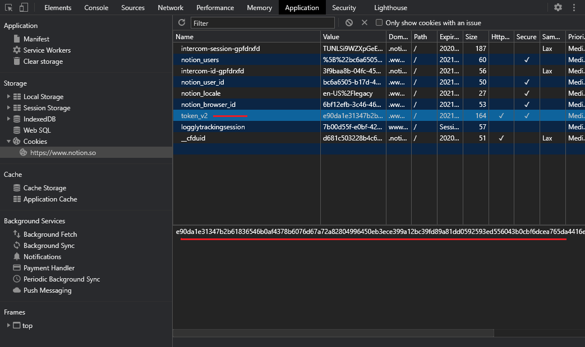

APP
=====
web donde formatea codigo a codigo snipper para vscode 

Sitios webs:
https://cocky-wilson-672604.netlify.app/
https://sosan.github.io/codesnipper/

PUBLICAR DATOS EN NOTION
========================
* **Si la pagina de notion es privada**, necesitaras el token de notion. Mas abajo explicamos como obtener el token.
* **Si la pagina de notion es publica**, no necesitaras el token de notion.

COMO CONSEGUIR TOKEN NOTION
=============================
 
