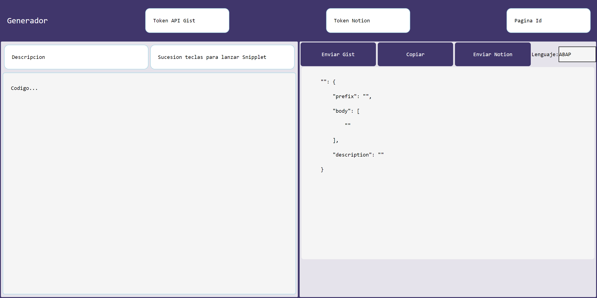

APP
=====
web donde formatea codigo a codigo snipper para vscode 

Sitios webs:
https://cocky-wilson-672604.netlify.app/
https://sosan.github.io/codesnipper/

PUBLICAR DATOS EN NOTION
========================
Para publicar en notion desde la web necesitaras token de notion.so

COMO CONSEGUIR TOKEN NOTION
=============================
Abres la web de notion. Boton derecho sobre la web, inspeccionar, pestaña applicacion (si no aparecere estara dentro de >> ) -> Cookies -> notion.so. click sobre token_v2. copiar valor de la zona inferior.
 
